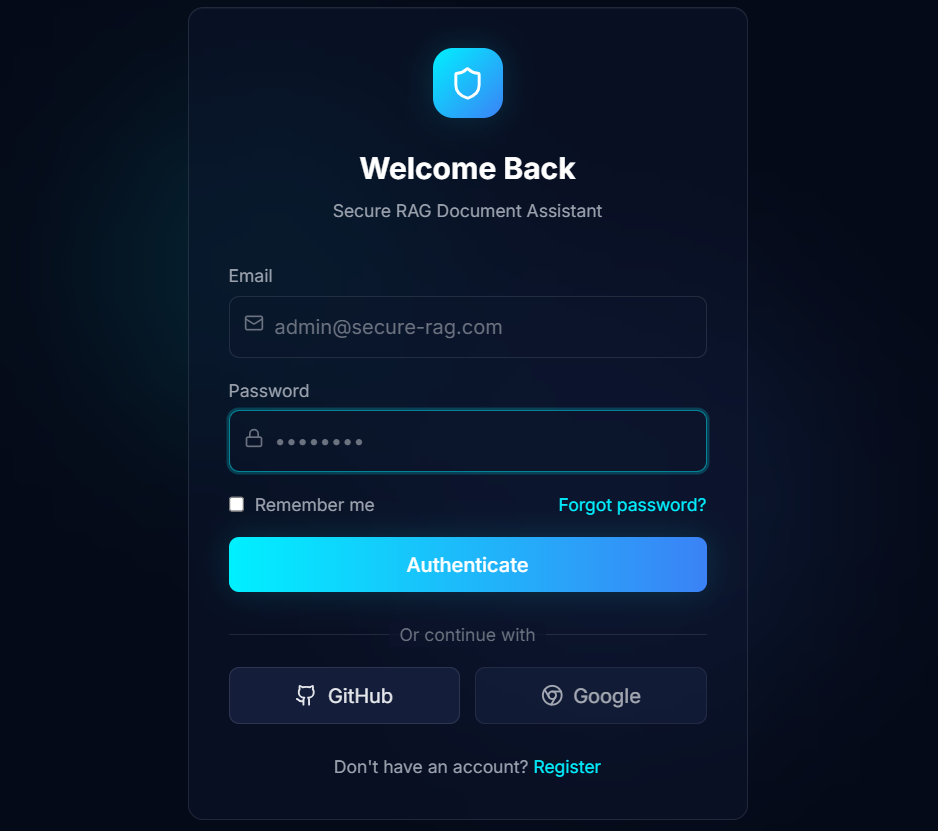
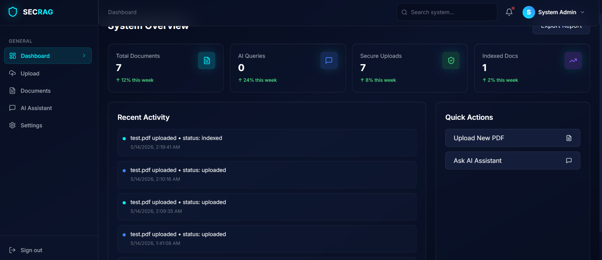
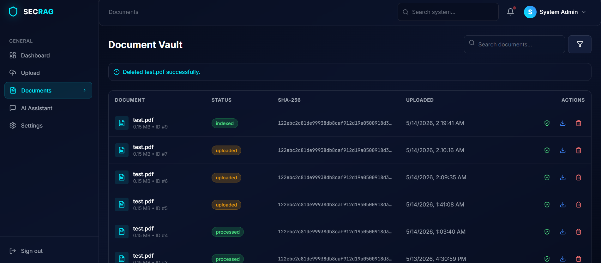
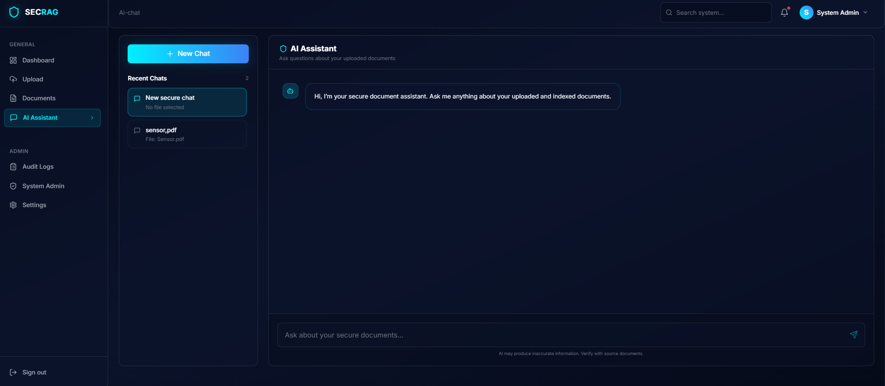
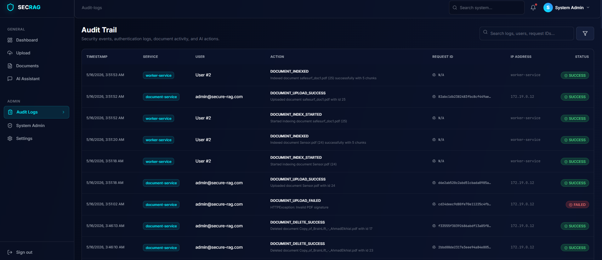

# 🛡️ Secure Distributed RAG Document Assistant

> AI-powered secure distributed document processing and RAG platform built with **FastAPI, React, RabbitMQ, PostgreSQL, Docker, Nginx, Ollama, and ChromaDB**.

---

# 🚀 System Architecture

```text
                ┌────────────────────┐
                │   React Frontend   │
                │   Vite + Tailwind  │
                └─────────┬──────────┘
                          │
                          ▼
                ┌────────────────────┐
                │   Nginx Gateway    │
                │ Rate Limiting +    │
                │ HTTPS + Routing    │
                └─────────┬──────────┘
                          │
      ┌───────────────────┼───────────────────┐
      ▼                   ▼                   ▼
┌─────────────┐   ┌─────────────┐   ┌─────────────┐
│ Auth        │   │ Document    │   │ RAG         │
│ Service     │   │ Service     │   │ Service     │
└─────┬───────┘   └─────┬───────┘   └─────┬───────┘
      │                 │                 │
      │                 ▼                 ▼
      │         ┌─────────────┐   ┌─────────────┐
      │         │ RabbitMQ    │   │ ChromaDB    │
      │         │ Queue       │   │ Vector DB   │
      │         └─────┬───────┘   └─────┬───────┘
      │               ▼                 ▼
      │        ┌─────────────┐   ┌─────────────┐
      │        │ Worker      │   │ Ollama      │
      │        │ Service     │   │ Local AI    │
      │        └─────┬───────┘   └─────────────┘
      │              ▼
      │      ┌───────────────┐
      └────► │ PostgreSQL    │
             └───────────────┘

                    ▼
             ┌───────────────┐
             │ Audit Service │
             │ Logs + Trace  │
             └───────────────┘
````

---

# ✨ Features

## 🔐 Authentication & Security

* ✅ JWT Authentication
* ✅ Email/password login
* ✅ User registration
* ✅ Google OAuth login
* ✅ GitHub OAuth login
* ✅ Role-Based Access Control
* ✅ Admin/User separation
* ✅ Secure password hashing with bcrypt
* ✅ Protected API routes
* ✅ Protected frontend routes
* ✅ Admin-only endpoints
* ✅ Automatic admin seeding
* ✅ Secure session handling using `sessionStorage`
* ✅ Logout clears session immediately
* ✅ Nginx rate limiting
* ✅ API Gateway security headers
* ✅ HTTPS support using self-signed local certificate

---

## 📄 Secure Document Management

* ✅ PDF-only upload validation
* ✅ MIME type validation
* ✅ PDF signature verification
* ✅ Dangerous extension blocking
* ✅ Filename sanitization
* ✅ SHA-256 hashing
* ✅ Fernet encryption
* ✅ Encrypted file storage
* ✅ Integrity verification
* ✅ Ownership-based access control
* ✅ Document download with decryption
* ✅ Document delete flow
* ✅ Document metadata stored in PostgreSQL
* ✅ Async document processing using RabbitMQ

---

## ⚡ Distributed Processing

* ✅ Microservices architecture
* ✅ Dockerized services
* ✅ RabbitMQ async messaging
* ✅ Worker-based background processing
* ✅ Distributed document pipeline
* ✅ Service isolation
* ✅ API Gateway routing
* ✅ Queue-based processing
* ✅ PostgreSQL persistence

---

## 🤖 AI & RAG Infrastructure

* ✅ Ollama integration
* ✅ ChromaDB vector database
* ✅ `nomic-embed-text` embeddings
* ✅ PDF text extraction
* ✅ Text chunking
* ✅ Vector indexing
* ✅ Semantic retrieval
* ✅ AI chat with uploaded documents
* ✅ Source chunk references
* ✅ Context-aware AI responses

---

## 🧾 Audit, Monitoring & Traceability

* ✅ Centralized audit logging
* ✅ Login success/failure tracking
* ✅ OAuth login audit events
* ✅ Document upload audit events
* ✅ Document integrity audit events
* ✅ Document download audit events
* ✅ Document delete audit events
* ✅ Distributed `X-Request-ID` tracing
* ✅ Request ID propagated from Nginx to services
* ✅ Request ID stored in audit logs
* ✅ Admin audit log viewer
* ✅ Admin monitoring dashboard

---

# 🔄 Current Workflow

```text
📄 User uploads PDF
        │
        ▼
🛡️ Document Service validates file
        │
        ▼
🔐 SHA-256 hash generated
        │
        ▼
🔒 PDF encrypted using Fernet
        │
        ▼
🗄️ Metadata stored in PostgreSQL
        │
        ▼
📨 Job published to RabbitMQ
        │
        ▼
⚙️ Worker consumes job
        │
        ▼
✅ Integrity verification
        │
        ▼
🧠 Text extraction + chunking
        │
        ▼
📦 Embeddings stored in ChromaDB
        │
        ▼
🤖 RAG Service retrieves context
        │
        ▼
💬 Ollama generates contextual answer
        │
        ▼
🧾 Audit logs store action + request_id
```

---

# 🛠️ Tech Stack

## ⚙️ Backend

* FastAPI
* SQLAlchemy
* PostgreSQL
* RabbitMQ
* aio-pika
* JWT
* bcrypt
* Fernet Encryption
* ChromaDB
* Ollama
* httpx
* pypdf

---

## 🎨 Frontend

* React
* Vite
* TailwindCSS
* React Router
* Lucide Icons
* Session Storage Auth

---

## 🧠 AI / RAG

* Ollama
* ChromaDB
* `nomic-embed-text`
* Semantic Retrieval
* Vector Embeddings
* Local LLM Generation

---

## 🐳 Infrastructure

* Docker
* Docker Compose
* Nginx
* HTTPS
* Microservices Architecture

---

# 🧩 Services

| Service             | Purpose                                     |
| ------------------- | ------------------------------------------- |
| 🔑 auth-service     | Authentication, JWT, OAuth, RBAC            |
| 📄 document-service | Secure upload, encryption, download, delete |
| ⚙️ worker-service   | Async PDF processing and vector indexing    |
| 🧠 rag-service      | RAG retrieval and AI answer generation      |
| 📋 audit-service    | Centralized audit logs and request tracing  |
| 🌐 nginx-gateway    | API gateway, HTTPS, rate limiting           |
| 🐘 postgres         | Relational database                         |
| 🐇 rabbitmq         | Message queue                               |
| 🧠 chromadb         | Vector database                             |
| 🤖 ollama           | Local AI embeddings and generation          |
| 🎨 frontend         | React frontend                              |

---

# 🔒 Security Features

* 🔑 JWT verification
* 👤 Role-based authorization
* 🌐 Google OAuth
* 🐙 GitHub OAuth
* 🛡️ Secure file validation
* 📄 PDF signature checks
* 🔐 SHA-256 integrity checks
* 🔒 Fernet encryption
* 🗄️ Encrypted storage
* 🚦 API rate limiting
* 👥 Ownership validation
* 🌐 Secure gateway routing
* 🧾 Audit trail logging
* 🔍 Distributed request tracing
* ⚡ Queue isolation
* 🧯 Security headers
* 🔐 HTTPS support

---

# 🎨 Frontend Features

## 👤 User Features

* Secure Login/Register
* Google OAuth login
* GitHub OAuth login
* Upload encrypted documents
* List user documents
* Verify document integrity
* Download decrypted PDF
* Delete documents
* AI chat with indexed documents
* User dashboard
* Settings page
* Session ends when tab/browser closes

---

## 🛡️ Admin Features

* Admin dashboard
* Audit log viewer
* Failed login tracking
* Security monitoring
* Service analytics
* System activity overview
* Request ID visibility in logs

---

# 📁 Project Structure

```text
secure-rag-document-assistant/
│
├── frontend/
│   ├── src/
│   │   ├── api/
│   │   ├── pages/
│   │   └── components/
│   └── vite.config.js
│
├── backend/
│   ├── docker-compose.yml
│   ├── gateway-nginx/
│   │   ├── nginx.conf
│   │   └── certs/
│   │
│   └── services/
│       ├── auth-service/
│       ├── document-service/
│       ├── worker-service/
│       ├── rag-service/
│       └── audit-service/
│
├── .gitignore
└── README.md
```

---

# ⚙️ Setup & Installation

## 📥 Clone Repository

```bash
git clone https://github.com/5iaal/secure-rag-document-assistant.git
cd secure-rag-document-assistant
```

---

## 🐳 Run Docker Infrastructure

```bash
cd backend
docker compose up -d --build
```

---

## 📦 Verify Running Containers

```bash
docker compose ps
```

---

## 🧠 Pull Ollama Embedding Model

```bash
docker exec -it ollama ollama pull nomic-embed-text
```

---

## 🎨 Start Frontend

```bash
cd frontend
npm install
npm run dev
```

---

# 👑 Default Admin Account

```text
Email: admin@secure-rag.com
Password: Admin12345
```

---

# 🔐 OAuth Setup

## GitHub OAuth Callback

```text
http://localhost/api/auth/github/callback
```

## Google OAuth Callback

```text
http://localhost/api/auth/google/callback
```

Add your credentials in:

```text
backend/.env
```

---

# 📡 API Examples

## 🔐 Login

```powershell
Invoke-RestMethod -Uri "http://localhost/api/auth/login" `
  -Method POST `
  -ContentType "application/json" `
  -Body '{"email":"admin@secure-rag.com","password":"Admin12345"}'
```

---

## 📄 Upload Document

```powershell
curl.exe -X POST "http://localhost/api/documents/upload" `
  -H "Authorization: Bearer TOKEN" `
  -F "file=@test.pdf;type=application/pdf"
```

---

## ✅ Verify Integrity

```powershell
Invoke-RestMethod -Uri "http://localhost/api/documents/1/verify" `
  -Method GET `
  -Headers @{Authorization="Bearer TOKEN"}
```

---

## 📥 Download Document

```powershell
curl.exe -L "http://localhost/api/documents/1/download" `
  -H "Authorization: Bearer TOKEN" `
  -o "downloaded-file.pdf"
```

---

## 🗑️ Delete Document

```powershell
Invoke-RestMethod -Uri "http://localhost/api/documents/1" `
  -Method DELETE `
  -Headers @{Authorization="Bearer TOKEN"}
```

---

## 🤖 Ask AI

```powershell
Invoke-RestMethod -Uri "http://localhost/api/rag/ask" `
  -Method POST `
  -Headers @{Authorization="Bearer TOKEN"} `
  -ContentType "application/json" `
  -Body '{"question":"What is this document about?","top_k":4}'
```

---

## 🔍 Test Request ID Tracing

```powershell
Invoke-RestMethod -Uri "http://localhost/api/auth/login" `
  -Method POST `
  -Headers @{"X-Request-ID"="test-auth-request-123"} `
  -ContentType "application/json" `
  -Body '{"email":"admin@secure-rag.com","password":"Admin12345"}'
```

---

# 📈 Current Project Status

## ✅ Completed

* Distributed microservices architecture
* JWT authentication system
* Google OAuth
* GitHub OAuth
* RBAC authorization
* Secure session management
* React frontend integration
* Secure PDF upload
* Document download
* Document delete
* Background document processing
* PDF extraction and chunking
* ChromaDB vector indexing
* Ollama embeddings integration
* AI RAG querying
* Audit logging service
* Request ID tracing
* Admin dashboard
* Document integrity verification
* Protected frontend routes
* HTTPS support
* Rate limiting
* Dockerized deployment

---

## 🚧 Planned Improvements

* Improve RAG answer quality
* RAG audit events
* Worker processing audit events
* Admin stats endpoint
* OCR support
* Streaming AI responses
* Toast notifications
* Better upload progress
* Better frontend chat UX
* Dead-letter queue / retry policies
* Redis caching
* Kubernetes deployment
* CI/CD pipeline

---

# 📸 Screenshots

## 🔐 Login Page



---

## 📊 Dashboard



---

## 📄 Documents



---

## 🤖 AI Chat



---

## 🧾 Audit Logs



---

# 🏆 Highlights

* 🔥 Fully Distributed Architecture
* 🔥 Secure-by-Design Backend
* 🔥 OAuth + JWT Authentication
* 🔥 Async Processing Pipeline
* 🔥 Production-Style Microservices
* 🔥 AI + Cybersecurity Combination
* 🔥 Dockerized End-to-End System
* 🔥 Local AI Processing
* 🔥 Enterprise-style Security Monitoring
* 🔥 Request Tracing and Auditability

---

# 👨‍💻 Author

## Ahmad Elkhial

* Cybersecurity & AI Developer
* Distributed Systems Enthusiast
* Backend & AI Engineer

GitHub:

[https://github.com/5iaal](https://github.com/5iaal)

---

# 📜 License

MIT License

```
```
